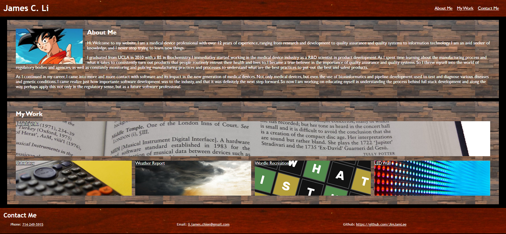

# 02-Advanced-CSS-Personal-Webpage

## Challenge User Story
AS AN employer
I WANT to view a potential employee's deployed portfolio of work samples
SO THAT I can review samples of their work and assess whether they're a good candidate for an open position

## Challenge Acceptance Criteria
GIVEN I need to sample a potential employee's previous work
WHEN I load their portfolio
THEN I am presented with the developer's name, a recent photo or avatar, and links to sections about them, their work, and how to contact them
WHEN I click one of the links in the navigation
THEN the UI scrolls to the corresponding section
WHEN I click on the link to the section about their work
THEN the UI scrolls to a section with titled images of the developer's applications
WHEN I am presented with the developer's first application
THEN that application's image should be larger in size than the others
WHEN I click on the images of the applications
THEN I am taken to that deployed application
WHEN I resize the page or view the site on various screens and devices
THEN I am presented with a responsive layout that adapts to my viewport

## My Goal
I will be using various CSS styling techniques to create a brand new personal webpage to meet the acceptance criteria above. Based on the user story, for this particular challenge, my website should provide a brief sample of my experiences and potential projects.

## Grading Requirements
This challenge is graded based on the following criteria:

### Technical Acceptance Crtieria:

* Application satisfies the above criteria.

### Deployment:

* Application is deployed at live URL on GitHub pages.

* Application loads with no errors.

* Application GitHub URL is submitted.

* GitHub repository contains application code.

### Application Quality:

* Application resembles the mock-up functionality provided in the Challenge instructions.

### Repository Quality: 

* Repository has a unique name.

* Repository follows best practices for file structure and naming conventions.

* Repository follows best practices for class/id naming conventions, indentation, quality comments, etc.

* Repository contains multiple descriptive commit messages.

* Repository contains quality README file with description, screenshot, and link to deployed application.

## Review

Submit the following for review:

* The URL of the deployed application.

* The URL of the GitHub repository, with a unique name and a README that describes the project.

## Application Screenshot

The following image shows the web application's appearance and functionality:

## Application Link

The following is a link to the deployed application in GitHub pages.

[James Li Challenge 02: Advanced CSS](https://jimjamlee.github.io/01-HTML-CSS-Git-Challenge/#social-media-marketing)